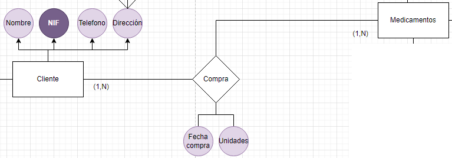
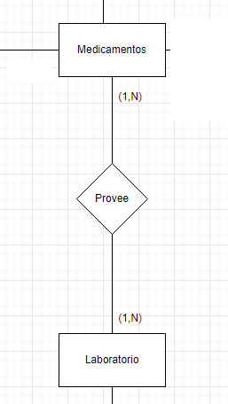
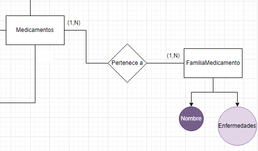

# ADBD_ModeloFarmacia

## Entidades

Son las que dan forma a la base de datos, en este caso, las entidades son las siguientes:

### Medicamentos
Esta se encarga de almacenar la información de los medicamentos disponibles en la farmacia.
sus atributos son:

- `Nombre` : Nombre del medicamento, es una cadena de caracteres y es un atributo identificador ya que no se pueden repetir nombres de medicamentos.
- `CodigoMedicamento` : Código del medicamento, es una cadena de caracteres y añadimos una restricción de unicidad.
- `Precio` : Precio del medicamento, es un número decimal.
- `Stock` : Cantidad de medicamentos disponibles, es un número entero y calculado en base a las compras y ventas.
- `UnidadesVendidas` : Cantidad de medicamentos vendidos, es un número entero y calculado en base a las compras y ventas.
- `RequieresPrescripción` : Indica si el medicamento requiere receta médica, es un valor booleano.
- `ProducciónPropia` : Indica si el medicamento es producido por la propia farmacia, es un valor booleano.

### Cliente
Esta se encarga de almacenar la información de los clientes de la farmacia, tanto los clientes normales como los creditarios.

sus atributos son:
- `NIF` : Número de Identificación Fiscal del cliente, es una cadena de caracteres y es un atributo identificador ya que no se pueden repetir NIF.
- `Nombre` : Nombre del cliente, es una cadena de caracteres.
- `Telefono` : Número de teléfono del cliente, es un número entero.
- `Direccion` : Dirección del cliente, es un atributo compuesto por otros 3:
    - `Ciudad` : Ciudad de residencia del cliente, es una cadena de caracteres.
    - `Calle` : Nombre de la calle, es una cadena de caracteres.
    - `Numero` : Número de la calle, es un número entero.
- `EsCreditario` : Indica si el cliente es creditario, es un valor booleano.
- `CuentaBancaria` : Número de cuenta bancaria del cliente, es una cadena de caracteres, en caso de no ser creditario se deja en NULL.
- `FechaPago` : Fecha en la que el cliente creditario debe realizar el pago, es una fecha, en caso de no ser creditario se deja en NULL.

### Laboratorio
Esta se encarga de almacenar la información de los laboratorios que producen los medicamentos.

sus atributos son:
- `Nombre` : Nombre del laboratorio, es una cadena de caracteres y es un atributo identificador ya que no se pueden repetir nombres de laboratorios.
- `CodigoLaboratorio` : Código del laboratorio, es una cadena de caracteres y añadimos una restricción de unicidad.
- `Direccion` : Dirección del laboratorio, es un atributo compuesto por otros 3:
    - `Ciudad` : Ciudad de residencia del laboratorio, es una cadena de caracteres.
    - `Calle` : Nombre de la calle, es una cadena de caracteres.
    - `Numero` : Número de la calle, es un número entero.
- `Telefono` : Número de teléfono del laboratorio, es un número entero.
- `Fax` : Número de fax del laboratorio, es un número entero.
- `NombreContacto` : Nombre de la persona de contacto, es una cadena de caracteres.

### FamiliaMedicamento
Esta se encarga de almacenar la información de las familias de medicamentos, una familia de medicamentos es un conjunto de medicamentos que combaten una misma enfermedad o tienen una misma función.

sus atributos son:
- `Nombre` : Nombre de la familia de medicamentos, es una cadena de caracteres y es un atributo identificador ya que no se pueden repetir nombres de familias de medicamentos.
- `Enfermedad` : Enfermedad que combate la familia de medicamentos, es una cadena de caracteres, multivaluado ya que una familia de medicamentos puede combatir varias enfermedades.

## Relaciones
### Cliente - Compra - Medicamento
Esta relación se encarga de almacenar la información de las compras realizadas por los clientes, tanto los clientes normales como los creditarios. 

  

  <em>Figura 1: Relación Cliente - Compra - Medicamento</em>

 

**Cardinalidad**: Un cliente puede comprar uno o varios medicamentos, y un medicamento puede ser comprado por uno o varios clientes.

La relación tiene inherente los siguientes atributos:
- `FechaCompra` : Fecha en la que se realizó la compra, es una fecha.
- `Cantidad` : Cantidad de medicamentos comprados, es un número entero.

### Laboratorio - Provee - Medicamento
Esta relación se encarga de almacenar la información de los medicamentos que provee cada laboratorio. 

  

  <em>Figura 2: Relación Laboratorio - Provee - Medicamento</em>

 

**Cardinalidad**: Un laboratorio puede prpveer uno o varios medicamentos (1,N), y un medicamento puede ser provisto por uno o varios laboratorios (1,N).

### Medicamento - Pertenece - FamiliaMedicamento
Esta relación se encarga de almacenar la información de las familias de medicamentos a las que pertenece cada medicamento. 

  

  <em>Figura 3: Relación Medicamento - Pertenece - FamiliaMedicamento</em>

 

**Cardinalidad**: Un medicamento puede pertenecer a una o varias familias de medicamentos, y una familia de medicamentos puede tener uno o varios medicamentos.

## Restricciones Semánticas

- **Medicamentos con o sin prescripción médica:**

Existen medicamentos que solo se pueden vender si el cliente presenta una receta médica. Esta restricción no puede representarse en un diagrama E-R, pero debe implementarse como una regla de negocio. Por ejemplo, el sistema debería verificar si un medicamento requiere prescripción y solicitar la receta médica al cliente en el momento de la venta, además de registrar que ya se ha usado esa receta, para no permitir su reutilización.

- **Control de stock:**

El sistema debe verificar si hay suficientes unidades de un medicamento en stock antes de permitir la venta. Si no hay unidades disponibles o el stock es insuficiente, no se debe procesar la compra. Esta es una regla que depende del estado actual de los datos y no puede ser representada solo en un diagrama E-R.

- **Alternativas de medicamentos por familia:**

Si un medicamento no está disponible, la farmacia puede ofrecer otro similar de la misma familia. Esta lógica de sustitución no puede representarse en el diagrama E-R directamente y requiere una regla de negocio que sugiera medicamentos alternativos a la hora de la venta en caso de que el medicamento deseado no esté disponible.

- **Clientes con crédito:**

Solo los clientes con crédito pueden realizar pagos a destiempo, mientras que los clientes sin crédito deben pagar al momento de la compra. Esta distinción entre tipos de clientes y el momento de pago no puede ser capturada completamente en el modelo E-R. Se necesita lógica adicional para aplicar diferentes condiciones de pago según el tipo de cliente.

- **Clientes con crédito deben tener datos bancarios:**

Los clientes con crédito siempre deben tener registrados sus datos bancarios y una fecha de pago. El diagrama E-R no puede imponer esta restricción de obligatoriedad; se requiere una validación en el sistema para asegurar que esta información esté presente al registrar un cliente con crédito y que se ponga a NULL en caso de que el cliente no tenga crédito.

- **Unidades de stock y precios no pueden ser negativas y formatos de telefono, NIF, cuenta bancaria, etc.:**

Los valores de stock y precios no pueden ser negativos, y los formatos de los atributos como teléfono, NIF, cuenta bancaria, etc., deben cumplir con ciertas reglas de formato. Estas restricciones no pueden ser representadas directamente en el diagrama E-R y deben ser implementadas como validaciones en el sistema.